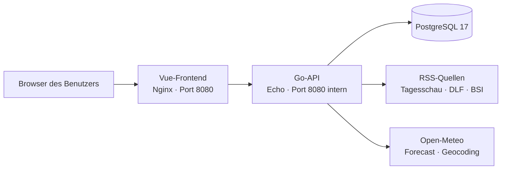

# Hermes – Systemhandbuch

> Stand: 24. Juli 2026  
> Status: lebende Projektdokumentation  
> Gültig für den aktuellen Branch `documentation`

Dieses Dokument ist die zentrale Übersicht über Hermes. Es beschreibt, was das
System heute kann, wie die Teile zusammenspielen, welche Entscheidungen bewusst
getroffen wurden und welche Erweiterungen als Nächstes sinnvoll sind.

Wenn sich eine Funktion, API-Route, Datenbanktabelle oder wichtige technische
Entscheidung ändert, sollte dieses Dokument im selben Commit aktualisiert werden.

## Hermes in einer Minute

Hermes ist eine private, lokal betriebene Kommandozentrale. Nach der Anmeldung
zeigt das Dashboard persönliche Notizen, einen Nachrichten-Radar und eine
Wetterzentrale. Die Anwendung läuft vollständig in Docker und besteht aus einem
Vue-Frontend, einer Go-API und einer PostgreSQL-Datenbank.

Hermes ist derzeit ausdrücklich kein öffentliches Internetprodukt. Die
Architektur ist deshalb auf einen privaten Rechner oder ein vertrauenswürdiges
Heimnetz ausgelegt. Externe Verbindungen werden nur dort genutzt, wo aktuelle
Daten gebraucht werden: für RSS-Nachrichten, Wettervorhersagen und die
Ortssuche.

Kurz gesagt:

- Der Feed ist das persönliche Gedächtnis.
- Der News-Radar sammelt und sortiert ausgewählte RSS-Quellen.
- Die Wetterzentrale vergleicht mehrere Vorhersagemodelle.
- PostgreSQL speichert Benutzer, Sitzungen, Notizen und den gewählten Wetterort.
- Docker Compose startet Datenbank, Backend und Frontend gemeinsam.

## Systemstatus auf einen Blick

| Bereich | Status | Inhalt |
| --- | --- | --- |
| Anmeldung und Sitzung | Vorhanden | Lokaler Benutzer, Passwortprüfung, siebentägige Sitzung |
| Persönlicher Feed | Vorhanden | Notizen anlegen, anheften, lösen und löschen |
| News-Radar | Vorhanden | Zwölf RSS-Quellen, Kategorien, Cache, Teilfehler und manueller Refresh |
| Wetterort | Vorhanden | Suche und persönliche Speicherung, Standard Köln-Dünnwald 51069 |
| Wetter heute bis fünf Tage | Vorhanden | ICON, IFS und GFS, Modellvergleich und Konsens |
| Interaktive Graph-Werte per Maus | Nächster Schritt | Punkt und exakte Werte beim Überfahren einer Kurve |
| 16-Tage-Modellvergleich | Entwurf getestet, aktuell nicht im Repository | ICON, IFS, AIFS und GFS |
| 30-Tage-Ensemblevergleich | Entwurf getestet, aktuell nicht im Repository | GFS GEFS und ECMWF EC46 mit Unsicherheitsband |
| Quicklinks | Idee | Persönliche Schnellzugriffe |
| Aufgaben und Erinnerungen | Idee | Aufgaben, Fälligkeiten und Benachrichtigungen |
| Kalender | Idee mit hoher Priorität | Termine und Tagesübersicht |
| Projekte | Idee | Projektstatus und nächste Schritte |

Wichtig: Die 16- und 30-Tage-Ansichten wurden in der letzten Ausbaurunde
konzipiert und lokal getestet. Die dafür vorgesehenen Outlook-Dateien sind im
aktuellen Checkout jedoch nicht vorhanden. Sie werden hier deshalb nicht als
fertige Produktfunktion geführt.

## So kannst du Hermes erklären

> Hermes ist mein lokales persönliches Dashboard. Es bündelt Notizen,
> ausgewählte Nachrichten und Wetterdaten an einem Ort. Beim Wetter zeigt es
> nicht nur eine einzelne Vorhersage, sondern vergleicht ICON, ECMWF IFS und
> GFS. Daraus berechnet es einen leicht verständlichen Konsens und zeigt auch,
> wie stark die Modelle voneinander abweichen. Das Ganze läuft bei mir lokal in
> Docker mit Vue, Go und PostgreSQL.

Die langfristige Idee ist eine persönliche Kommandozentrale, die später auch
Kalender, Aufgaben, Erinnerungen, Quicklinks und Projekte verbindet.

## Architektur



### Komponenten

| Komponente | Technik | Aufgabe |
| --- | --- | --- |
| Frontend | Vue 3, TypeScript, Vite | Oberfläche, Navigation, Diagramme und Fehlerdarstellung |
| Webserver | Nginx | Liefert das gebaute Frontend aus und leitet `/api` an das Backend weiter |
| Backend | Go, Echo | Authentifizierung, Geschäftslogik, externe Datenabrufe und API |
| Datenbank | PostgreSQL 17 | Dauerhafte Speicherung persönlicher Daten und Sitzungen |
| Orchestrierung | Docker Compose | Baut, startet und überwacht die drei Dienste |

Von außen ist nur das Frontend auf `http://localhost:8080` erreichbar. Backend
und Datenbank kommunizieren innerhalb des Docker-Netzwerks.

## Bedienung und vorhandene Funktionen

### 1. Anmeldung

Beim ersten Start legt das Backend den konfigurierten Administrator an, sofern
der Benutzer noch nicht existiert. Das Passwort wird mit bcrypt gehasht.

Nach erfolgreicher Anmeldung:

- erzeugt das Backend ein zufälliges Sitzungstoken,
- speichert ausschließlich dessen Hash in PostgreSQL,
- setzt ein `HttpOnly`-Cookie mit `SameSite=Strict`,
- hält die Sitzung sieben Tage gültig.

Beim Abmelden wird die Sitzung in der Datenbank gelöscht und das Cookie
abgelaufen gesetzt. Abgelaufene Sitzungen werden regelmäßig bereinigt.

### 2. Persönlicher Feed

Der Feed ist der einfache persönliche Notizbereich von Hermes.

Vorhanden sind:

- neue Textnotizen anlegen,
- höchstens 50 Einträge laden,
- wichtige Einträge anheften oder wieder lösen,
- eigene Einträge löschen,
- angeheftete Einträge vor den übrigen anzeigen,
- danach nach Aktualität sortieren.

Alle Einträge gehören genau einem Benutzer. Ein Benutzer kann nur seine eigenen
Einträge verändern oder löschen.

### 3. News-Radar

Der News-Radar lädt RSS-Feeds aus zwölf vorkonfigurierten Quellenbereichen:

- Deutschland und Welt: Tagesschau
- Politik, Wissenschaft, Kultur, Wirtschaft und Sport: Deutschlandfunk
- Technologie: Tagesschau
- Security: BSI / CERT-Bund
- Musik und Literatur: Deutschlandfunk Kultur
- Wetter und Klima: Tagesschau

Die Oberfläche bietet Kategorien, Artikelanzahl, Quelle, Veröffentlichungszeit
und einen manuellen Refresh.

#### Warum der News-Refresh jetzt schneller und robuster ist

Die Feeds werden parallel statt nacheinander geladen. Gleichzeitig sind
höchstens vier Abrufe aktiv, und jede Quelle erhält ein eigenes Zeitlimit von
fünf Sekunden. Dadurch kann eine langsame Quelle nicht mehr den gesamten
News-Radar lange blockieren.

Zusätzlich:

- werden Ergebnisse 15 Minuten im Speicher gecacht,
- werden identische parallele Aktualisierungen zusammengelegt,
- werden doppelte Artikel über URL oder ID entfernt,
- werden Artikel nach Veröffentlichungszeit sortiert,
- führen einzelne kaputte Quellen nur zu sichtbaren Warnungen,
- scheitert der komplette Refresh erst, wenn keine Quelle brauchbare Artikel
  geliefert hat.

Damit ist ein Teilfehler erkennbar, ohne dass alle erfolgreichen Nachrichten
verschwinden.

### 4. Wetterzentrale

Die Wetterzentrale ist der bisher tiefste Analysebereich von Hermes. Sie nutzt
Open-Meteo als einheitliche Datenschnittstelle und vergleicht drei operative
Vorhersagemodelle:

| Anzeige | Modellfamilie | Herkunft |
| --- | --- | --- |
| ICON | `icon_seamless` | Deutscher Wetterdienst |
| IFS | `ecmwf_ifs025` | ECMWF |
| GFS | `gfs_seamless` | NOAA |

Open-Meteo vereinheitlicht die unterschiedlichen Modelldaten. Hermes selbst
bereitet sie anschließend für Vergleich, Diagramme und Konsens auf.

#### Wetterort

Der Standardort ist:

`Köln-Dünnwald (51069), Nordrhein-Westfalen, Deutschland`

In der Oberfläche kann nach Postleitzahl oder Ortsname gesucht werden. Die
Auswahl wird pro Benutzer in PostgreSQL gespeichert. Gespeichert werden Name,
Region, Land, Koordinaten und Zeitzone.

#### Aktuelle und stündliche Daten

Hermes zeigt:

- aktuelle und gefühlte Temperatur,
- Wetterzustand,
- Windgeschwindigkeit,
- stündliche Temperaturverläufe,
- Regenwahrscheinlichkeit,
- erwartete Niederschlagsmenge,
- den Vergleich der drei Modellkurven für die kommenden Stunden.

#### Fünf-Tage-Ausblick

Für fünf Tage stehen je Modell zur Verfügung:

- minimale und maximale Temperatur,
- maximale gefühlte Temperatur,
- maximale Regenwahrscheinlichkeit,
- Wetterzustand,
- Sonnenaufgang und Sonnenuntergang.

Die Tagesübersicht verwendet Medianwerte der Modelle, damit ein einzelner
Ausreißer die Zusammenfassung nicht dominiert.

#### Hermes-Konsens

Hermes zeigt nicht nur Rohdaten, sondern fasst die Modelllage zusammen:

- Median der erwarteten heutigen Höchsttemperatur,
- niedrigste und höchste Modellprognose,
- Temperaturspanne als Maß für die Uneinigkeit,
- eine verständliche Vertrauensstufe,
- Regenübereinstimmung der Modelle für die nächsten sechs Stunden,
- zusammengefasste Regenwahrscheinlichkeit,
- voraussichtlichen Regenbeginn,
- einen einfachen Hitzehinweis.

Der Hitzehinweis ist eine Hermes-Heuristik und ausdrücklich keine amtliche
Hitzewarnung des Deutschen Wetterdienstes.

#### Cache und Ausfallsicherheit

Wetterantworten werden pro Ort 15 Minuten im Arbeitsspeicher des Backends
gehalten. Ein normaler Aufruf nutzt gültige Cache-Daten. Ein manueller Refresh
umgeht den gültigen Cache.

Falls Open-Meteo vorübergehend nicht erreichbar ist, darf Hermes eine ältere
Antwort als `stale` zurückgeben. So bleibt die letzte bekannte Prognose sichtbar
und die Oberfläche kennzeichnet ihre Herkunft.

Der externe HTTP-Aufruf hat ein Zeitlimit von zwölf Sekunden.

## Fehlerbehandlung im Frontend

Das Frontend besitzt in `frontend/src/api.ts` einen zentralen API-Client.
Dadurch behandeln Feed, News, Wetter und Anmeldung Fehler einheitlicher.

Der Client:

- sendet Sitzungs-Cookies bei gleichen Ursprüngen mit,
- verarbeitet JSON-Antworten,
- unterscheidet HTTP-Status und Backend-Fehlercode,
- übersetzt bekannte Fehler in verständliche deutsche Meldungen,
- erkennt ungültige oder leere API-Antworten,
- meldet eine abgelaufene Sitzung zentral an die Anwendung.

Das behebt das frühere Verhalten, bei dem einzelne Frontend-Komponenten Fehler
teilweise verschluckten oder nur sehr allgemeine Meldungen zeigten.

## API-Referenz

Alle Routen beginnen mit `/api`.

| Methode | Route | Aufgabe |
| --- | --- | --- |
| `GET` | `/health` | Zustand des Backends prüfen |
| `POST` | `/login` | Benutzer anmelden und Sitzung erstellen |
| `GET` | `/me` | Aktuell angemeldeten Benutzer laden |
| `POST` | `/logout` | Sitzung beenden |
| `GET` | `/feed` | Eigene Feed-Einträge laden |
| `POST` | `/feed` | Feed-Eintrag anlegen |
| `DELETE` | `/feed/:id` | Eigenen Eintrag löschen |
| `PATCH` | `/feed/:id/pin` | Eintrag anheften oder lösen |
| `GET` | `/news` | Cache nutzen oder News laden |
| `POST` | `/news/refresh` | News-Aktualisierung erzwingen |
| `GET` | `/weather` | Wetter für den gespeicherten Ort laden |
| `POST` | `/weather/refresh` | Wetter-Aktualisierung erzwingen |
| `GET` | `/weather/locations?q=...` | Orte über Open-Meteo suchen |
| `PUT` | `/weather/location` | Persönlichen Wetterort speichern |

Abgesehen von Healthcheck und Anmeldung benötigen die persönlichen Funktionen
eine gültige Sitzung.

## Datenmodell

Hermes erstellt seine Tabellen beim Backend-Start direkt aus dem Go-Code.

| Tabelle | Zweck | Wichtige Daten |
| --- | --- | --- |
| `users` | Lokale Benutzer | Benutzername, Anzeigename, Passwort-Hash |
| `sessions` | Aktive Anmeldungen | Benutzer, Token-Hash, Ablaufzeit |
| `feed_entries` | Persönliche Notizen | Typ, Titel, Inhalt, angeheftet, Zeitstempel |
| `user_weather_settings` | Wetterort pro Benutzer | Ortsdaten, Koordinaten, Zeitzone |

Fremdschlüssel löschen Sitzungen, Feed-Einträge und Wettereinstellungen mit,
wenn der zugehörige Benutzer gelöscht wird.

### Entscheidung für das MVP

Die Migrationen liegen momentan direkt im Programmcode. Für ein lokales MVP ist
das überschaubar und funktioniert. Bei mehreren Umgebungen, komplexeren
Schemaänderungen oder echten Rollbacks sollte später ein versioniertes
Migrationswerkzeug eingeführt werden. Das ist bewusst zurückgestellt und kein
aktueller Blocker.

## Lokaler Betrieb

### Benötigt

- Docker Desktop beziehungsweise Docker Engine mit Compose
- eine `.env`-Datei im Projektstamm

Verwendete Umgebungsvariablen:

```text
POSTGRES_USER
POSTGRES_PASSWORD
POSTGRES_DB
HERMES_ADMIN_USERNAME
HERMES_ADMIN_DISPLAY_NAME
HERMES_ADMIN_PASSWORD
SESSION_COOKIE_NAME
```

Passwörter und andere konkrete Geheimnisse gehören nicht in diese
Dokumentation und nicht ins Git-Repository.

### Starten

```powershell
docker compose up -d --build
```

Danach ist Hermes normalerweise unter
[`http://localhost:8080`](http://localhost:8080) erreichbar.

### Zustand prüfen

```powershell
docker compose ps
```

Erwartet werden drei laufende Container:

- `hermes-db`
- `hermes-api`
- `hermes-frontend`

### Logs ansehen

```powershell
docker compose logs --tail=100 backend
docker compose logs --tail=100 frontend
docker compose logs --tail=100 db
```

### Frontend lokal prüfen

Im Verzeichnis `frontend`:

```powershell
npm run build
npm run lint
```

Der Build enthält auch den TypeScript- beziehungsweise Vue-Typecheck.

### Backend prüfen

Im Verzeichnis `backend`:

```powershell
go test ./...
```

Falls Go nur im Container verfügbar ist, kann der Test auch über einen passenden
Backend-Build- oder Entwicklungscontainer ausgeführt werden.

## Deployment-Skript

`scripts/deploy-pi.sh` ist für einen bestehenden Raspberry-Pi-Workflow gedacht.
Es:

1. wechselt in einen fest eingetragenen Projektpfad,
2. prüft den Git-Status,
3. lädt Änderungen per Fast-forward,
4. erstellt ein PostgreSQL-Backup,
5. baut und startet Docker Compose,
6. zeigt den Containerstatus.

Der fest eingetragene Pfad und die enge Bindung an eine bestimmte Maschine sind
für den persönlichen Einsatz derzeit akzeptiert. Eine Überarbeitung mit
konfigurierbarem Pfad, besserer Fehlerbehandlung und dokumentierter
Wiederherstellung ist bewusst auf später verschoben.

## Repository-Landkarte

```text
hermes/
├── backend/
│   ├── cmd/api/
│   │   ├── main.go          # Start, Auth, Sitzungen, Routen, Benutzer
│   │   ├── feed.go          # Persönlicher Feed
│   │   ├── news.go          # RSS-Quellen, Cache und paralleler Refresh
│   │   ├── weather.go       # Ort, Modelle, Konsens und Wetter-API
│   │   └── weather_test.go  # Tests der Wetterlogik
│   ├── Dockerfile
│   └── go.mod
├── frontend/
│   ├── src/
│   │   ├── api.ts                         # Zentraler API-Client
│   │   ├── App.vue                        # Anmeldung und App-Zustand
│   │   ├── views/DashboardView.vue        # Dashboard-Zusammenbau
│   │   └── features/
│   │       ├── feed/FeedPanel.vue
│   │       ├── news/NewsPanel.vue
│   │       └── weather/WeatherPanel.vue
│   ├── nginx.conf
│   ├── package.json
│   └── Dockerfile
├── scripts/deploy-pi.sh
├── compose.yaml
└── HERMES_HANDBUCH.md
```

## Was in den letzten Ausbaurunden verändert wurde

### News-Radar

- RSS-Quellen werden parallel mit begrenzter Gleichzeitigkeit geladen.
- Jede Quelle besitzt ein eigenes kurzes Zeitlimit.
- Gleichzeitige Refresh-Anfragen werden zusammengeführt.
- Einzelne Quellenfehler werden als Warnungen sichtbar.
- Erfolgreiche Artikel bleiben auch bei Teilfehlern erhalten.
- Duplikate werden entfernt und Artikel sauber sortiert.

### Gemeinsame Frontend-API

- Wiederholte Request-Logik wurde in `src/api.ts` zentralisiert.
- Anmeldung, Feed, News und Wetter erhalten verständlichere Fehlermeldungen.
- Abgelaufene Sitzungen werden zentral behandelt.
- Fehler werden nicht mehr still in einzelnen Komponenten verschluckt.

### Wetterzentrale

- Open-Meteo-Wetterdaten wurden angebunden.
- Köln-Dünnwald 51069 wurde als sinnvoller Standardort gesetzt.
- Ortssuche und persönliche Ortsauswahl wurden ergänzt.
- ICON, ECMWF IFS und GFS werden gleichzeitig geladen.
- Temperatur- und Regenverläufe werden visuell verglichen.
- Ein Modellkonsens mit Spanne, Vertrauen, Regenlage und Hitzehinweis wurde
  ergänzt.
- Cache, manueller Refresh und Rückfall auf ältere Daten wurden umgesetzt.

### Bewusst nicht überzogen

Folgende Themen wurden diskutiert und für den lokalen MVP absichtlich
zurückgestellt:

- vollständige Härtung für einen öffentlichen Internetbetrieb,
- separates und versioniertes Migrationssystem,
- umfassende Schema- und Eingabevalidierung über den aktuellen Bedarf hinaus,
- universelles Deployment-Skript für mehrere Maschinen.

Diese Entscheidungen sind keine vergessenen Fehler, sondern eine
Priorisierung: erst sichtbarer Nutzen im lokalen Alltag, dann zusätzliche
Infrastruktur, sobald ein echter Bedarf entsteht.

## Nächste sinnvolle Schritte

### Priorität 1: Interaktive Wetterdiagramme

Beim Überfahren einer Kurve sollte Hermes:

- eine vertikale Hilfslinie einblenden,
- auf jeder Modellkurve einen Punkt markieren,
- Datum und Uhrzeit anzeigen,
- exakte Temperaturwerte je Modell nennen,
- bei Regenansichten Wahrscheinlichkeit und Menge zeigen,
- auf Touch-Geräten per Tippen funktionieren.

Das verursacht praktisch keine relevante Verlangsamung. Die Werte sind bereits
geladen; das Frontend muss nur den Mauszeiger einer vorhandenen Diagrammposition
zuordnen. Zusätzliche API-Aufrufe sind dafür nicht notwendig.

### Priorität 2: 16-Tage-Modellvergleich

Sinnvoll ist ein eigener, bei Bedarf geladener Langfristbereich:

- ICON, IFS, AIFS und GFS soweit in der jeweiligen Reichweite verfügbar,
- tägliche Höchst- und Tiefsttemperaturen,
- Umschaltung zwischen Maximum und Minimum,
- Medianlinie und sichtbare Modellspanne,
- deutlicher Hinweis, dass die Unsicherheit mit jedem Tag wächst.

### Priorität 3: 30-Tage-Ensemble

Für 30 Tage sollte kein einzelner scheinbar exakter Wert gezeigt werden.
Stattdessen ist ein Ensemblevergleich sinnvoll:

- GFS GEFS mit mehreren Rechenläufen,
- ECMWF EC46 mit mehreren Rechenläufen,
- Median `P50`,
- Unsicherheitsband zwischen `P10` und `P90`,
- getrennte Ansichten für Temperatur und Niederschlag,
- spätes Laden und eigener Cache, weil die Datenmenge größer ist.

### Priorität 4: Kalender

Der Kalender ist die logisch nächste große Hermes-Säule:

- heutige und kommende Termine,
- Tages- und Wochenansicht,
- Kalenderquellen auswählbar,
- Verknüpfung mit Aufgaben,
- Vorbereitung und Erinnerung vor Terminen,
- später optional Anbindung an Google Calendar oder Outlook.

Für den ersten lokalen Schritt reicht ein eigener Hermes-Kalender. Eine externe
Synchronisation sollte erst danach ergänzt werden, damit Datenmodell und
Bedienung nicht direkt von einem Anbieter abhängen.

### Priorität 5: Aufgaben und Erinnerungen

Ein möglicher MVP:

- Aufgabe mit Titel und optionaler Beschreibung,
- Fälligkeit und Priorität,
- Status offen, erledigt oder verschoben,
- Ansicht „Heute“, „Diese Woche“ und „Später“,
- Verbindung zu einem Termin oder Projekt,
- lokale Erinnerung im Dashboard.

### Weitere Möglichkeiten

- Quicklinks mit Icon, Kategorie und persönlicher Sortierung
- Projektkarten mit Status, nächstem Schritt und letzter Aktivität
- globale Suche über Notizen, Aufgaben, Termine und Projekte
- tägliche Morgenübersicht aus Wetter, Terminen, Aufgaben und Top-News
- Fokusmodus mit nur den aktuell wichtigen Informationen
- Datenexport und lokale Wiederherstellung
- konfigurierbare News-Quellen direkt in der Oberfläche
- Systemstatus für Cache-Alter, letzte erfolgreiche Abrufe und Datenquellen

## Grenzen und Annahmen

### Nur lokaler Betrieb

Aktuell wird Hermes über lokales HTTP betrieben. Das Sitzungscookie verwendet
`HttpOnly` und `SameSite=Strict`, aber kein `Secure`-Flag, weil dieses nur über
HTTPS übertragen würde. Das passt zum momentanen lokalen Aufbau.

Sobald Hermes aus dem Internet erreichbar werden soll, müssen mindestens HTTPS,
`Secure`-Cookies, Reverse-Proxy-Konfiguration, Rate-Limits,
Brute-Force-Schutz, Secret-Management und eine engere Netzwerkfreigabe neu
bewertet werden.

### Externe Daten bleiben externe Abhängigkeiten

Hermes selbst bleibt lokal, aber News und Wetter brauchen Internetzugriff.
Quellen können langsam sein, URLs ändern oder zeitweise ausfallen. Cache,
Zeitlimits und sichtbare Warnungen reduzieren dieses Problem, beseitigen es aber
nicht vollständig.

### Wetter ist keine Gewissheit

Modelle sind verschiedene Berechnungen, keine unabhängigen Messgeräte. Ein enger
Modellkorridor erhöht das Vertrauen, garantiert aber kein Ereignis. Besonders
langfristige Prognosen sollten als Trend und Wahrscheinlichkeitsraum verstanden
werden.

### Speicher-Cache ist flüchtig

News- und Wettercache liegen momentan im Arbeitsspeicher des Backends. Nach
einem Neustart sind sie leer und werden beim nächsten Abruf neu aufgebaut.

## Glossar

| Begriff | Bedeutung |
| --- | --- |
| ICON | Wettermodellfamilie des Deutschen Wetterdienstes |
| IFS | Operatives Vorhersagesystem des ECMWF |
| AIFS | KI-basiertes Vorhersagesystem des ECMWF |
| GFS | Global Forecast System der NOAA |
| GEFS | Ensemblevariante des GFS mit vielen leicht veränderten Läufen |
| EC46 | ECMWF-Ensemble für den erweiterten Vorhersagezeitraum |
| Deterministisch | Ein einzelner Modelllauf liefert einen konkreten Verlauf |
| Ensemble | Viele leicht veränderte Läufe zeigen Bandbreite und Wahrscheinlichkeit |
| Median / P50 | Mittlerer Wert; die Hälfte der Läufe liegt darunter, die Hälfte darüber |
| P10–P90 | Bereich, in dem die mittleren 80 Prozent der Ensemblewerte liegen |
| Modellspanne | Abstand zwischen niedrigster und höchster Modellvorhersage |
| Cache | Kurzzeitig gespeicherte Antwort, die erneute externe Abrufe vermeidet |
| Stale | Ältere Cache-Antwort, die bei einem Ausfall als Rückfall verwendet wird |
| RSS | Standardformat, über das Nachrichtenseiten neue Artikel bereitstellen |

## Pflege-Checkliste

Bei jeder größeren Änderung kurz prüfen:

- Ist die neue Funktion in der Statusübersicht eingetragen?
- Muss „Hermes in einer Minute“ angepasst werden?
- Hat sich eine API-Route oder ein Antwortformat geändert?
- Gibt es eine neue Tabelle, Spalte oder Umgebungsvariable?
- Haben sich Cache-Zeit, Timeout oder externe Quelle geändert?
- Ist eine geplante Funktion jetzt wirklich im Repository vorhanden?
- Sind lokale und öffentliche Sicherheitsannahmen noch korrekt?
- Wurde die Repository-Landkarte aktualisiert?
- Ist ein neuer bekannter Grenzfall entstanden?
- Ist der nächste sinnvolle Schritt noch derselbe?

## Dokumentationsregel

Dieses Handbuch beschreibt immer den eingecheckten Stand, nicht nur eine
erfolgreiche lokale Versuchsversion. Geplante oder getestete, aber nicht
eingecheckte Funktionen werden deutlich als solche markiert. So bleibt das
Dokument verlässlich und kann als Grundlage für Gespräche, Planung und spätere
Entwicklung dienen.
